# Session 1
## Data Pipelines CLI: Setting up environment and loading data to dwh

Welcome to the **GetInData Modern Data Platform** workshop - `session #1`. In this introductory tutorial you will:
- create and deploy your own dbt project [data-pipelines-cli](https://data-pipelines-cli.readthedocs.io/en/latest/index.html) tool in `Vertex AI` environment
- navigate through various DataOps tools in JupyterLab environment
- create your working repository in Gitlab
- navigate through Bigquery console and familiarize with exercises data
- (optional) create your gcp account
- (optional) create your Gitlab account
- (optional) create your Slack account

For today's exercises the target environment will be Google Cloud Platform's: `BigQuery`, `Vertex AI Managed Notebook` and `VSCode` as IDE.

This tutorial uses our DataOps JupyterLab XXXXXXXXXXXXX.
For more versions and images check out [our public repo](https://github.com/getindata/jupyter-images/tree/master/jupyterlab-dataops).

**Note**: if you're new to data-pipelines-cli and want to know more about the library, check the [documentation](https://data-pipelines-cli.readthedocs.io/en/latest/index.html).

# Exercise

## Setting up environment
1. Go to `Vertex AI`: [here](https://console.cloud.google.com/vertex-ai/workbench/list/instances?referrer=search&project=bdtw-mdp-workshop&supportedpurview=project).

3. Click on `New Notebook` located in the top bar and then `Customize...`

   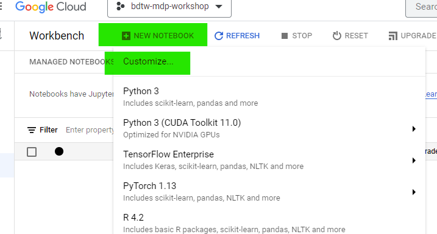

3. Type in notebook name (preferably your first and last name, example: `john-smith-workshops`) and press continue.

    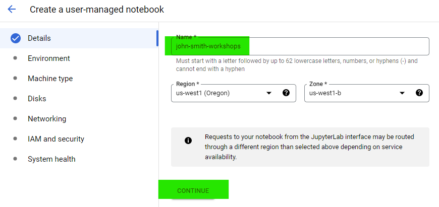
   
5. In environment section, choose Debian 10, `Custome container` 

    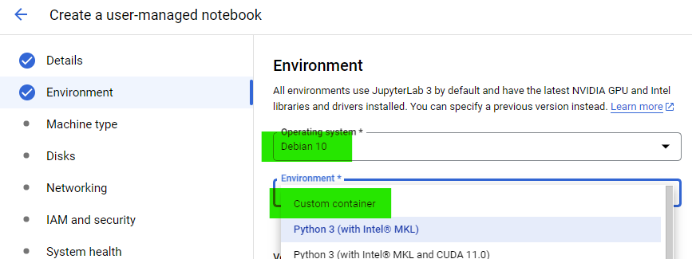

    and provide a link to the Data Pipelines CLI image: 
    ```
    gcr.io/getindata-images-public/jupyterlab-dataops@sha256:12e217ab88f823308214203628bfe72b0ad233aace3c982efdac023184eb2f79
    ```

    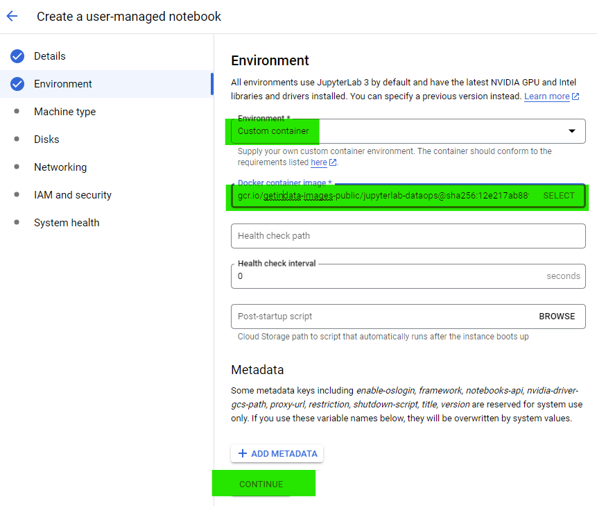

6. In machine configuration section, choose `n1-standard-1 machine 1vCPU/3.75GB RAM (~0.044 USD / hour)`

    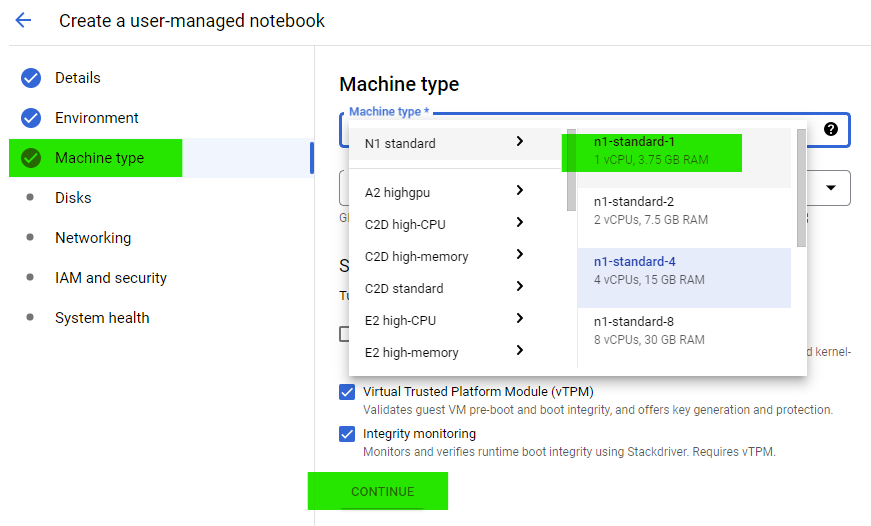

7. Leave everything else on default.
8. Click on `Create`
9. Wait until it spins up correctly and click on `Open JupyterLab`

    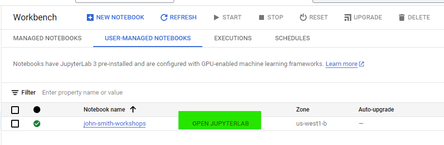


## Optional: create your GCP account and access our BigQuery project on Google Cloud Platform.

1. Go to `google.com` and click on `sign in` icon on the top right corner of the web page screen.
2. Click on `Create account` using `For my personal use` drop down option and proceed with account creation by filling up all necesary fields:

    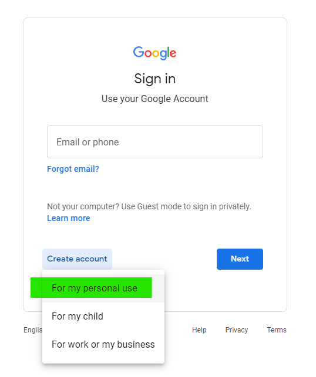

3. Enter the following address:

    ```
    https://cloud.google.com/
    ```

4. Enter the Google Cloud Console by clicking the `Console` icon (choose your language and accept Terms of use afterwards):

    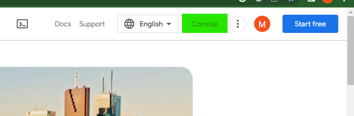

5. Scanning through Google navigation bar, locate `BigQuery` and enter `SQL workspace`

    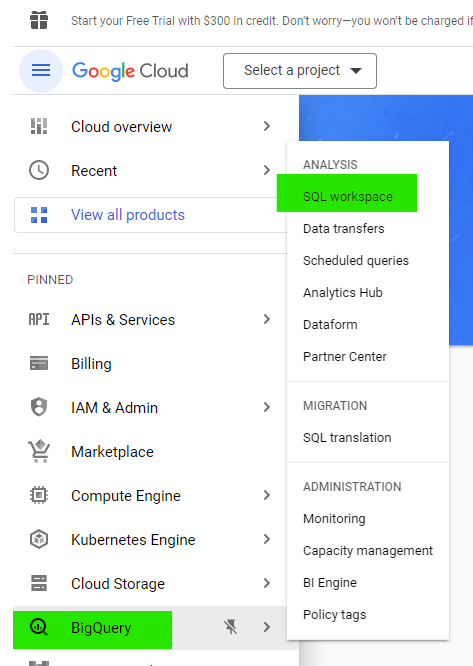

6. In top left corner, click on `Select a project` icon, switch to `ALL` projects and choose `bdwt-mdp-workshop`

    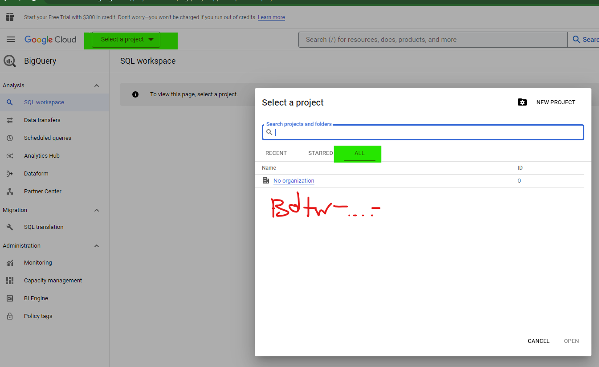

## Optional: create Gitlab account.

1. Copy-paste the following link into your web navigation bar:

    ```
    https://gitlab.com/gitlab-org/gitlab
    ```

2. On bottom-right corner of the web page click on `Register`

    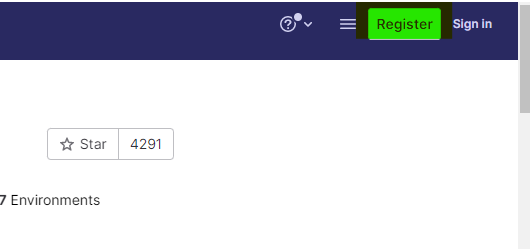

3. Choose `Register with Google` and proceed:

    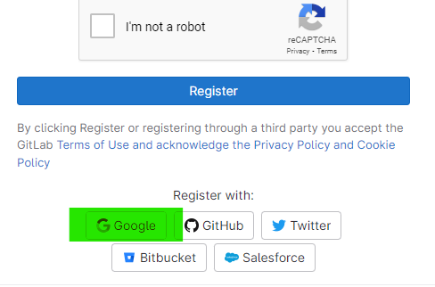

4. In Gitlab personalization widnow, fill up all the fields (you can use the example showed below)

    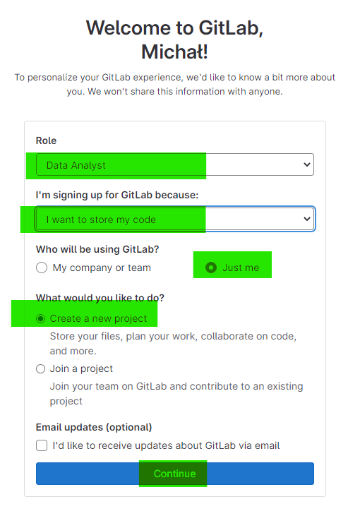

5. Gitlab will ask you to create your first project. This step is required to proceed with account creation (you can't skip it) but we will not use this repository for our workshops. Instead, you will be invited to participate in a Gitlab group created for the workshop. Nevertheless for for practice, you could type the work group and project name as follows:

    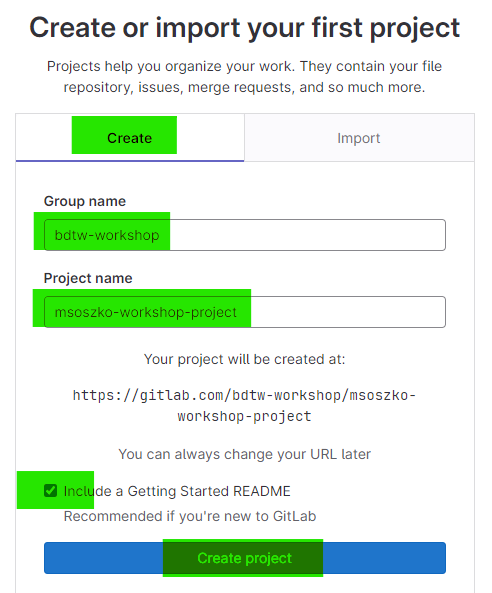

