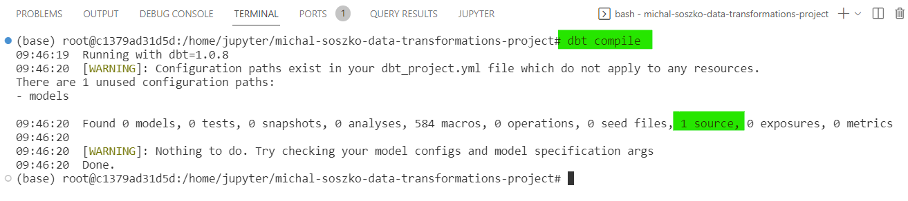

# Session 2a

## GetInData Modern Data Platform: Create simple data pipeline in dbt

Welcome to the **GetInData Modern Data Platform** workshop hands-on `session 2a`. 

By the end of this tutorial, you will learn how to:
- define `sources` in `dbt`
- load static seed data to the data warehouse with the use of `dbt seed`
- create a simple transformation and execute it using `dbt run`

Target environment will be Google Cloud Platform's: `BigQuery & Data Studio`, `Vertex AI Managed Notebook`, `VSCode` as IDE. 

This tutorial uses our DataOps JupyterLab image 1.0.9.
For more versions and images check out [our public repo](https://github.com/getindata/jupyter-images/tree/master/jupyterlab-dataops).


# Exercise


## Introduction

The following exercises will get you through the basic concepts of dbt. For that, we will use our ecommerce dataset and treat it as freshly Extracted and Loaded (EL) raw data and perform several data transformations (T) leading to calculation of VAT for sales report. 

## Defining sources in `dbt`.

Sales data can be found in `raw_data.order_items` table. You can preview schema and data itself by inspecting the [`order_items`](https://console.cloud.google.com/bigquery?authuser=0&project=bdtw-mdp-workshop&ws=!1m5!1m4!4m3!1sbdtw-mdp-workshop!2sraw_data!3sorder_items) column in Bigquery. As tax rate can differ depending on place the purchase was made we need to extract information about users` country. This can be found in the [users](https://console.cloud.google.com/bigquery?authuser=0&project=bdtw-mdp-workshop&ws=!1m5!1m4!4m3!1sbdtw-mdp-workshop!2sraw_data!3susers) table.

The main rule for `dbt` is that we should avoid writing SQL code referencing datasets and tables stored in `dwh` directly. Instead we should use proper referencing functions `dbt` comes with. So, in order to introduce raw data in our `dbt` project we should define it in form of `yaml` file. To create sources definition follow the instructions:

1. Open your VertexAI notebook and launch VSCode.

2. Navigate to your project folder and locate `models` folder.

3. Right-click on the `models` folder and create new file. Call it: `source_order_items.yml`

4. Inside of the `source_order_items.yml` paste the following code:

    ```
    version: 2

    sources:
    - name: raw_data
      tables:
      - name: order_items
    ```

    Here, you defined source `name`, which normaly is the same as the `schema` name in your data warehouse (in our example - `raw_data`). Under the `table / name` field you described name of the raw table, which in this case is `order_items`.

    Find more information about dbt sources in dbt documentation: https://docs.getdbt.com/docs/build/sources

5. In order to check whether your source has been defined correctly (note that yaml files are whitespace-sensitive):

    5a. open your terminal (`CTRL+SHIFT+~`)
    
    5b. inside your project folder type:

    ```
    dbt compile
    ```
    
    Dbt will compile the project and return summary report as follows:

    

    If there is `1 source` detected, you have succesfully defined our 1st data source.

6. Now, try to define the second source on your own:

    6a. In `models` folder create a yaml file called `source_users.yml`

    6b. Fill the file with information regarding schema name (`raw_data`) and table name (`users`)

    6c. Compile the project using the `dbt compile` command and inspect the results.

    If there were no mistakes, the summary compilation report should provide information about `2 sources` detected by `dbt`.

## Add a CSV file to your data warehouse

