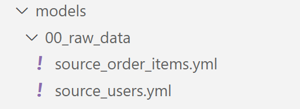
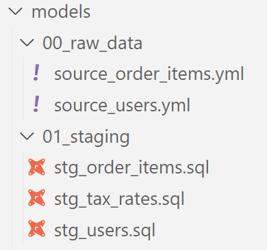
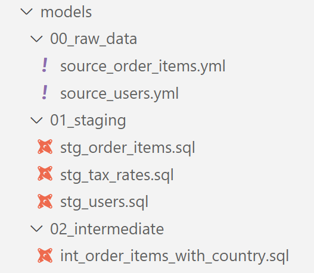
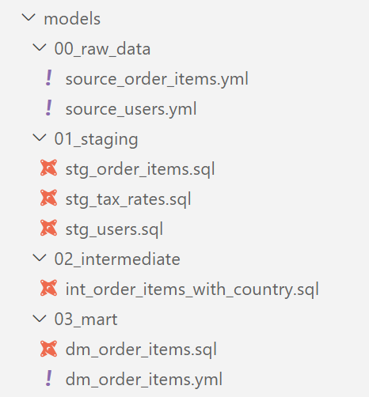

# Session 3

## GetInData Modern Data Platform: Test and document models

Welcome to the **GetInData Modern Data Platform** workshop hands-on `session 3`. 

By the end of this tutorial, you will learn how to:
- improve your dbt pipeline by using modern project structuring conventions
- apply jinja macro in your SQL code
- publish your work to DEV using Git and CICD
- review the pipeline execution results in data catalog and connect data with a BI tool

Target environment will be Google Cloud Platform's: `BigQuery & Data Studio`, `Vertex AI Managed Notebook`, `VSCode` as IDE. 

This tutorial uses our DataOps JupyterLab image gcp-1.5.0.
For more versions and images check out [our public repo](https://github.com/getindata/jupyter-images/tree/master/jupyterlab-dataops).


# Exercises

## Introduction

A proper structuring of a project in dbt is crucial because it allows for efficient and organized development of data models. With a well-defined structure, it becomes easier to manage dependencies between models, track changes, and maintain a consistent approach to development. This helps ensure the accuracy and reliability of the data produced by the models, and facilitates collaboration among team members working on the project. 

In section 3 we will refactor the pipeline we already created and apply modern project structuring approach. Then we will commit our work to remote repository. The repository is stored in GitLab, a web-based repository manager that is part of our modern data stack. GitLab also provides continuous integration and delivery, allowing our code (after some treatment) to be distributed across various components of our modern data stack, such as the scheduler, data catalog, ingestion tool, and BI tool.

In this chapter we will reforge our set of dbt models into a well organized and structured project, dividing it into three logic layers: `staging`, `intermediate` and `mart`. 


## Refactoring the dbt pipeline

### Staging area

A `Staging area` is a transformation layer where data is cleaned (by formating, spliting / concating, json extracting etc.), column naming convention is applied, as well as some basic calculation and conversions are included. In this layer we avoid joining models.

1. In `models` folder inside of your project create subfolder called `00_raw_data`.

2. Move (ie. by using drag and drop) both `source_order_items.yml` and `source_users.yml` into newly created `models/00_raw_data folder`.

    The result should look as follows:

    

3. Perform a code check by running `dbt compile` command in the command line.

4. Create second subfolder in `models` directory, call it `01_staging`.

5. Inside of the `01_staging` folder create new model file called `stg_order_items.sql`.

6. Add the following SQL statement:

    ```
    with source as (
        select * from {{ source('raw_data', 'order_items') }}
    ),
    cleaned as (
        select
            id                      as order_item_id,
            order_id                as order_id,
            user_id                 as user_id,
            product_id              as product_id,
            inventory_item_id       as inventory_item_id,
            status                  as order_status,
            created_at              as order_created_at,
            shipped_at              as order_shipped_at,
            delivered_at            as order_delivered_at,
            returned_at             as order_returned_at,
            sale_price              as order_item_sale_price
        from source
    )
    select * from cleaned
    ```

    Note, this is the staging model, where we are referencing the source (`{{ source (....) }}`) placed in `00_raw_data` folder. For dbt it does not matter where the model is stored - and that is because all model names need to be unique. Inside of SQL we changed column names applying our custom naming convention.

7. Perform a code check by running `dbt compile` command in the command line.

8. Exercise: Repeat steps `5` - `7` for new model file called `stg_users`. 
    
    > Hint: You can choose whatever column naming convention you prefer.

    > Hint2: Use Bigquery to check schema for `raw_data.users` table.

<details>
<summary>Preview example of the resulting SQL statement</summary>
<br>
<pre>
with source as (
    select * from {{ source('raw_data', 'users') }}
),
cleaned as (
    select
        id                  user_id,
        first_name          user_first_name,
        last_name           user_last_name,
        email               user_email,
        age                 user_age,
        gender              user_gender,
        state               user_address_state,
        street_address      user_street_address,
        postal_code         user_postal_code,
        city                user_city,
        country             user_country,
        latitude            user_geo_latitude,
        longitude           user_geo_longitude,
        traffic_source      user_acc_traffic_source,
        created_at          user_acc_created_at
    from source
)
select * from cleaned
</pre>
</details>

9. Create the third staging model, this time for our `seed_tax_rates` CSV file. Call it `stg_tax_rates.sql`. Put the following code inside and perform `dbt compile` check:
    
    ```
    with tax_rates as (
        select * from {{ ref( 'seed_tax_rates' ) }}
    ),
    cleaned as (
        select 
            Country         as country,
            Tax_Rate        as tax_rate,

            trim(Country)   as country_cleaned
        from tax_rates
    )
    select * from cleaned
    ```

    Note that in this model, apart lowercasing column names, we added new column called `country_cleaned`. you might have noticed that in `model_order_items_with_tax.sql` the join between `order_items_with_country` column and `tax_rates` is performed on `trim(tax_rates.Country)`. The purpose of staging layer is to avoid such complications for downstream models if possible. This is a simple example but you could imagine a complicated join on a case-when statement in several subqueries making the code a little bit harder to understand.

After performing steps 1-9 your `models/` you should obtain a similar image:




### Intermediate area

An `Intermediate area` is a transformation layer where we apply complex conversions, business logic, calculations, joins etc. Tables (views) we create here are close in shape to what we'd like to use for reporting and analysis. However, the resulting data is intermediate and requires further treatmen. Intermediate models are generaly hidden from data consumers and BI tools. Plus, intermediate models always reference staging / source data.

1. In `models` directory, create a new subfolder, call it `02_intermediate`.

2. Inside of the `02_intermediate` folder create new model file called `int_order_items_with_country.sql`.

3. Exercise: Knowing the `int_order_items_with_country` intermediate model is nearly a 1:1 copy of the existing `model_order_items_with_country`, fill up the new model with a proper SELECT statement.

    >Note: New model should be referencing staging models created in previous chapter

<details>
<summary>Preview example of the resulting SQL statement</summary>
<br>
<pre>
with order_items as (
    select * from {{ ref('stg_order_items') }}
),
users as (
    select * from {{ ref('stg_users') }}
)
select
    oi.order_item_id,
    oi.order_id,
    oi.user_id,
    oi.product_id,
    oi.order_status,
    oi.order_item_sale_price,
    u.user_country
from
    order_items as oi
left join
    users as u on oi.user_id = u.user_id
</pre>
</details>

4. Compile the dbt project to check for a presence of errors. At this point it would be reasonable to run the new part of the pipeline as well. For that you can use the following command:

    ```
    dbt run --select +int_order_items_with_country
    ```

5. If the pipeline succeeds you can preview resulting views in Bigquery.

After performing steps 1-5 your project structure should now look similar to the example below:




### Marts area

A `mart layer` is a type of transformation layer that is used to build a data models optimized for querying and analysis. A mart layer typically includes tables that represent the different dimensions and measures of the data model, as well as any derived or calculated fields that are needed for analysis.

1. In `models` directory, create a new subfolder, call it `03_mart`.

2. Inside of the `03_mart` folder create new model file called `dm_order_items.sql` and attach YAML metaconfig - `dm_order_items.yml`.

3. Exercise: propose a SQL statement and YAML config for newly created (empty) model. Similar to previous chapter's intermediate example, use the fact that `dm_order_items` (along with its metacofnig YAML) is nearly a 1:1 copy of the `model_order_items_with_tax`.

    > Note: dm_order_items should be referencing 1 staging model and 1 intermediate model.

<details>
<summary>Preview an example of SQL statement here</summary>

<pre>
with _int_order_items_with_country as (
    select * from {{ ref( 'int_order_items_with_country' ) }}
),
tax_rates as (
    select * from {{ ref( 'stg_tax_rates' ) }}
)
select
    order_item_id,
    order_id,
    user_id,
    product_id,
    order_status,
    order_item_sale_price,
    user_country,
    tr.tax_rate,
    round(order_item_sale_price * (tr.tax_rate / 100), 2) as order_items_sale_VAT
from
    _int_order_items_with_country as oi
left join
    tax_rates as tr on oi.user_country = tr.country_cleaned
</pre>
</details>

<details>
<summary>Preview an example of YAML config here</summary>

<pre>
version: 2
<br>
models:
- name: dm_order_items
    description: "
    ## Order items with calculated VAT 
<br>
    This is the `order_items` model enhanced with  <br>    
    - country column taken from `users` model<br>  
    - tax rates values taken from `seed_tax_rates` CSV file"<br>
    columns:
    - name: order_item_id
    description: 'Unique id of the ordered item, primary key'
    tests:
        - unique
        - not_null<br>
    - name: order_status
    description: Current status of the order
    tests:
        - accepted_values:
            values: ['Shipped', 'Complete', 'Cancelled', 'Processing', 'Returned']<br>
    - name: order_item_sale_price
    description: "Item's sale price"
    tests:
        - is_positive_value<br>
    - name: order_item_sale_vat
    description: 'Calculated VAT for item sold within the order'
</pre>
</details>

4. Compile the dbt project to check for a presence of errors. At this point it would be reasonable to run the new part of the pipeline as well. For that you can use the following command:

    ```
    dbt run --select +dm_order_items
    ```

5. If the pipeline succeeds you can remove all SQL and YAML files from the `models` main folder, leaving only models stored in layer subdirectories. Also, you can preview resulting views in Bigquery. 

After performing steps 1-5 your project structure should now look similar to the example below:

